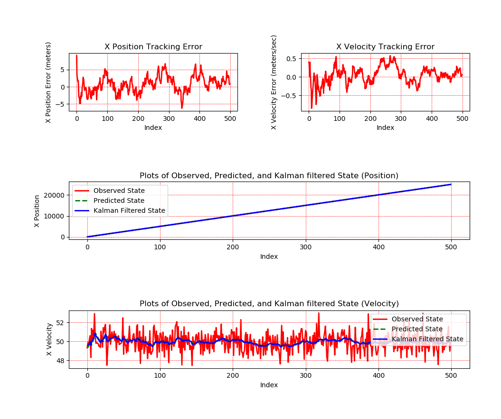
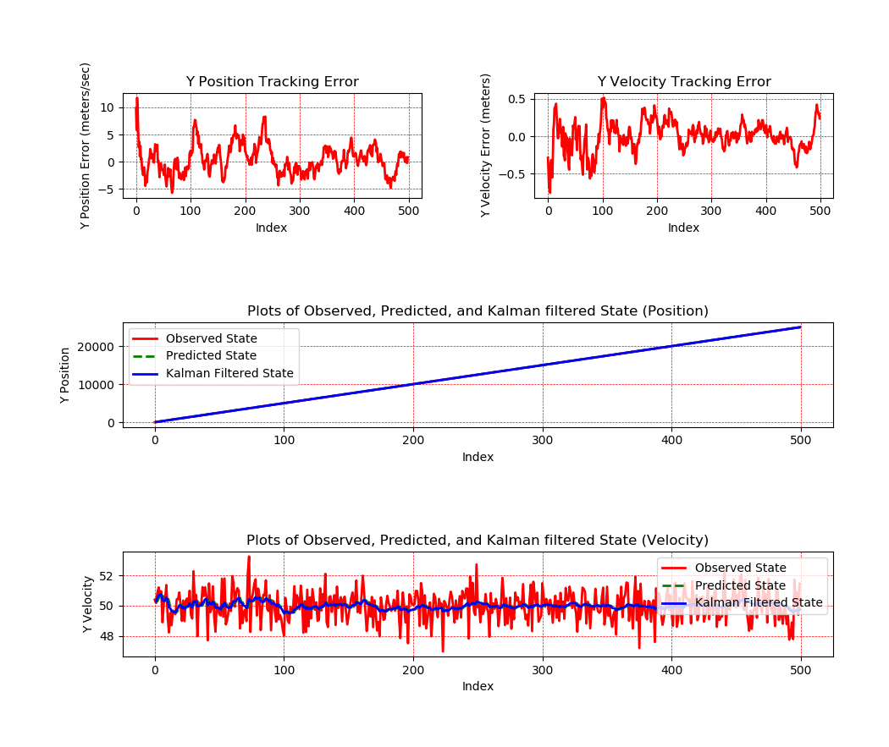
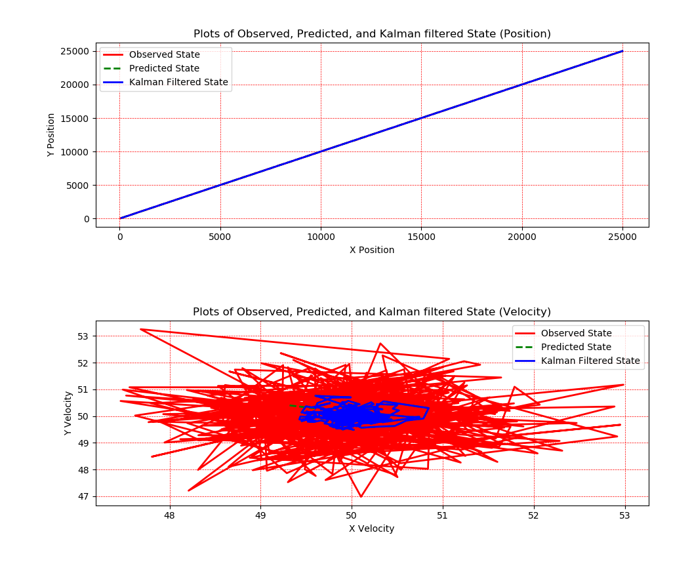

# Kalman Filters

The Kalman Filter has long been regarded as the optimal solution to many tracking and data prediction tasks. It is composed of two basic functions: **Predict** and **Update**. The *Predict* function predicts vehicle state at timestamp *(k + 1)* given its state at timestamp *k* based on the knowledge of vehicle's dynamics which we represent as motion model. The *Update* model then updates/corrects the believe about its position at timestamp *(k + 1)* after a new measurement have been received. The predict and update equations provide a recursive way to compute the posterior of the state for every measurement that we receive.

## Results

---
| Error in x position and velocity  |  Error in y position and velocity |
|:---------------------------------:|:---------------------------------:|
|             |             |  

*Figure 1: X and Y position error plots*

---

  
*Figure 2: Plot of 2D position and velocity*

---
Kalman Filter is implemented in the ```KalmanFilter.py``` python script. This file implements two classes: **KalmanFilter1D** for 1-Dimensional Kalman filter and **KalmanFilter2D** for two dimensional Kalman Filter. Run the file ```test_kf.py``` to test the Kalman Filters. 

For testing purposes, random noise is added to the data. However, in reality the noise is gaussian in nature.